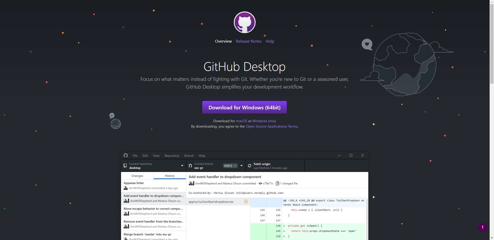
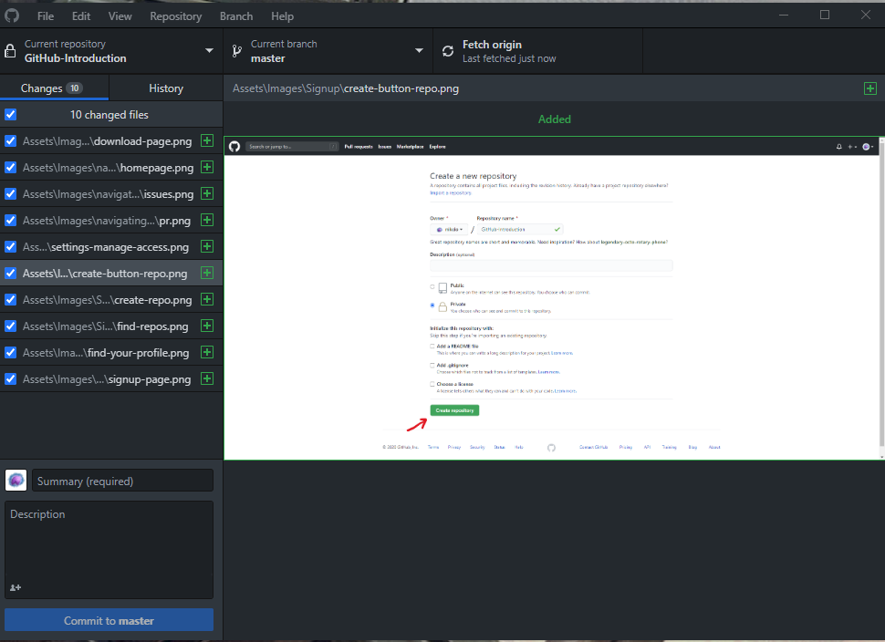
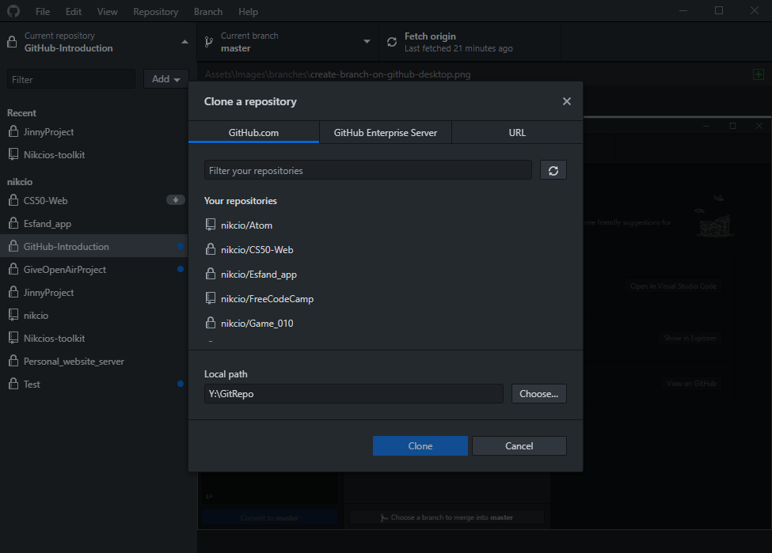

# Step 3 - GitHub desktop

You should now have successfully created your first repo. We now have to figure out how to submit our code to the repo.

### What is Git?
Git is a version control that makes it easier as developers to collaborate and version your code. This means it acts as a middle man between your computer and for example [GitHub](github.com). Natively Git is a command-line application and doesn't have that much visual fidelity. Therefore programs like GitHub desktop exist.

### What is a GitHub desktop?
GitHub Desktop is a program that makes it easier to work with Git and GitHub. It's a program that lets us do the most regular tasks with ease.
To download GitHub desktop go to [https://desktop.github.com/](https://desktop.github.com/) and press the download button. (If you have a mac be sure to press the macOS button just below the download button.)

Once GitHub desktop has been installed you'll be prompted to sign in to your GitHub profile. Just follow the onscreen directions. When this has been completed you'll be presented to the GitHub desktop interface. Here there are a few important buttons to know.

First off there's the current repository button in the top left. By clicking this you'll be able to switch between repositories and even create a new or clone an existing repository by clicking the Add button. To get the repository you created on your GitHub page press the Clone an existing repository button. Here you'll be able to pick which repository you'll like to clone. (In this context cloning a repository means downloading the content onto your computer.)

The next important area is the Changes box on the left. This shows which files were changed since you last committed your files to the repository. Below the Changes box, we also see the box which is used for committing files to your repository. (Committing will be further explained in [Step 4 - Committing](../Step%204%20-%20Committing/README.md))

On the top center of GitHub Desktop, we see the Current branch button. Here we can select which branch we'll be working on. (Branches will be further explained in [Step 5 - Branches](../Step%204%20-%20Committing/README.md))

The last important button is the Fetch origin button. This button has multiple uses:

1. Fetching updates on the current repository (Checking for changes made to the GitHub repository)
2. Pulling updates on the current repository (Downloading changes)
3. Pushing commits to the current repository (Uploading your changes)

Now that we're familliar with GitHub desktop we can move on to [Step 4 - Committing](../Step%204%20-%20Committing/README.md)