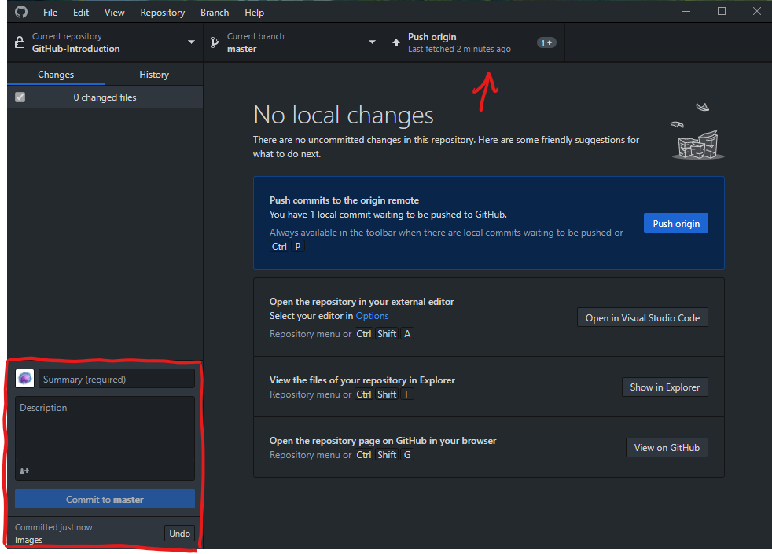
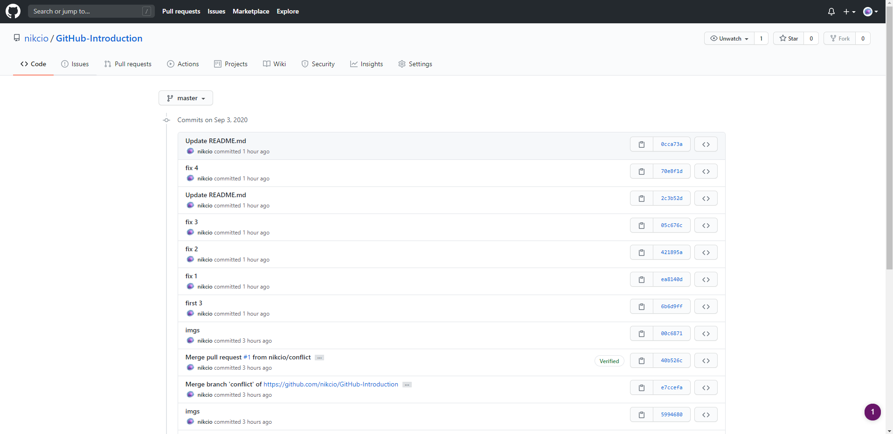

# Step 4 - Committing 

Now that we're familliar with GitHub Desktop we have to understand the concept of commits.

### What is a commit?
You can look at a commit like an update to your code, a package of changes to your files. What's special about a commit is that it's titled and have the abillity to accompany a description of what changes was made. Thereby, it's possible to orginize what code was changed.
To make a commit in GitHub Desktop we have to title our commit and press the commit button.

When you have pressed the blue button on the bottom left you'll have committed your changes but the changes hasn't yet been uploaded to your GitHub repository. To do this you have to press the Push origin button. Now you're able to view your commit on the commit history on your repository. (To find the comit history visit [Step 7 - Navigating the repository](../Step%207%20-%20Navigating%20the%20repository/README.md))

Now we're ready to move on to [Step 5 - Branches](../Step%205%20-%20Branches/README.md)