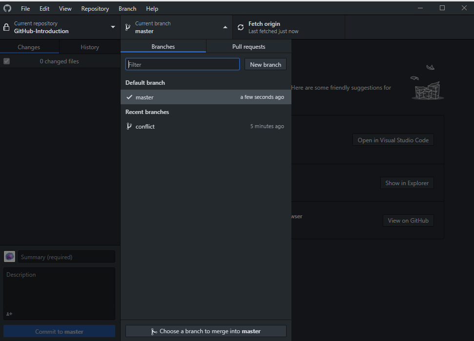
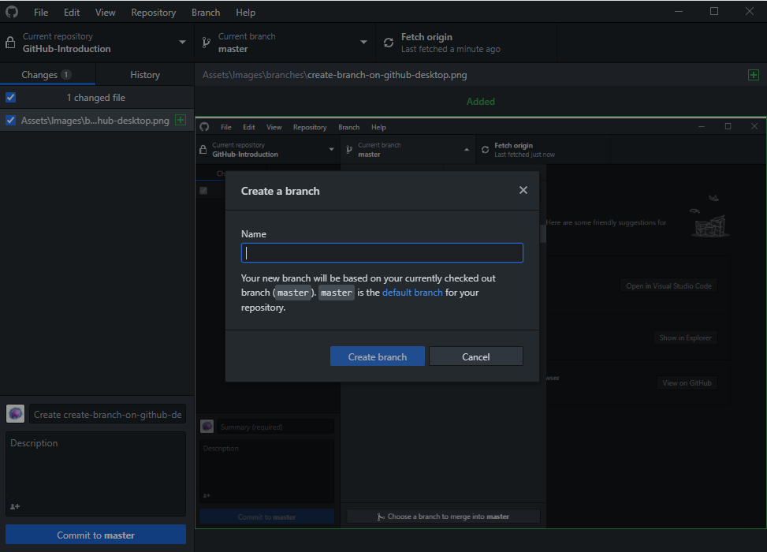

# Step 5 - Branches

Now that we can commit our changes we need to learn about branches.

### What are branches?
Branches in Git refer to different versions of the repository. This can be useful for working on different features simutaniusly. On every new repository the master is the default branch which is created. From this branch it's possible to create your own branches.
To create a new branch in GitHub Desktop we're going to press the Current branch button on top.

Here we'll press the New branch button. (On a sidenote this is also the place where we can switch betwreen existing branches)

Now when we press Create branch the new branch will be created and we'll be moved to the new branch. If we have uncommited changes we'll be asked to either leave the changes on the current branch or bring the changes to the new branch.

Next stop is [Step 6 - Pull requests](../Step%206%20-%20Pull%20requests/README.md)