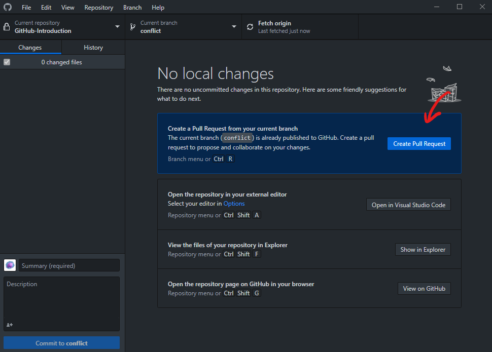
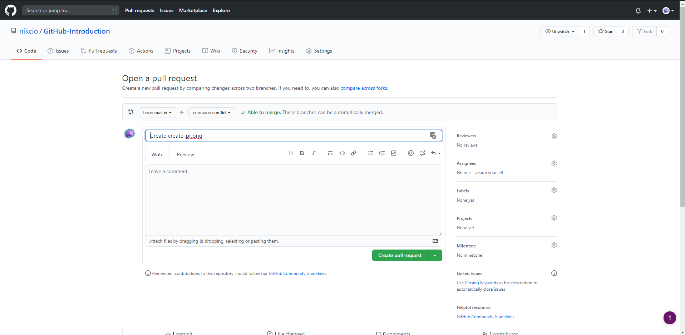
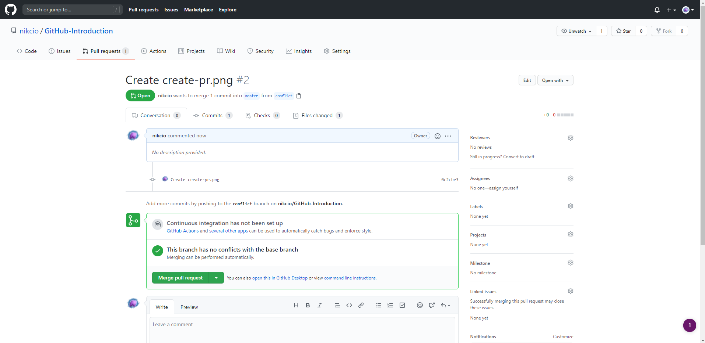
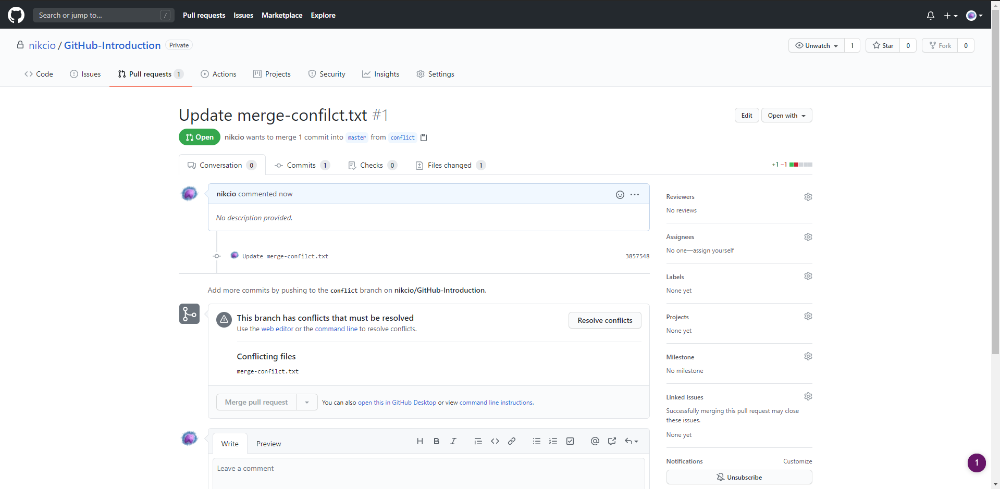
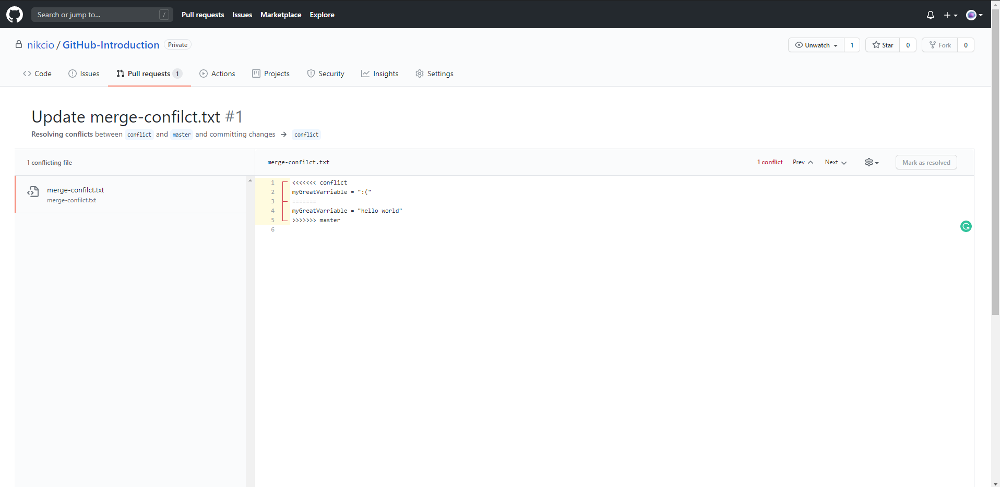
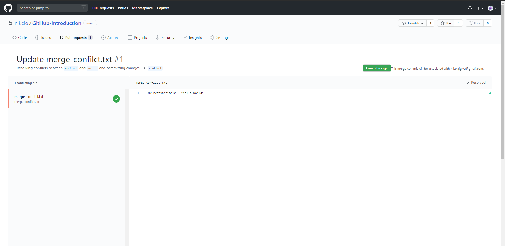

# Step 6 - Pull requests

Now that we've learned to work with branches we need a way to merge our branches to all changes that are available in one place.

### What is a pull request?
Pull requests also known as pr for short are vital to any good collaboration. Pull request gives developers an extraordinary opportunity to review changes and catch faulty code. It's also the best way to merge one branch into another.
Put simply a pull request is an operation where GitHub checks if one branch can be merged with another. Let's take a look at how to create a pull request via GitHub Desktop.

When you have pushed some commits to the branch you're working on a button called Create pull request will appear. By clicking this you will be taken to the GitHub web page where you can create the pull request.

Here it's possible to set multiple parameters but the most important is the two buttons at the top. These buttons show which branch will be merged into which branch should the pull request be successful. By default, this will always show your current branch being merged into the master branch. Below you can set a title for the pull request and write a comment if needed. When you have filled all the information you need you can press the Create pull request button. This will go ahead and create the pull request.

This will show which commits are part of the pull request. This is a great time to have your team review your changes. This can be done by clicking on the Files changed button at the top.
Sometimes you might have changed a file which was also changed somewhere else. This will create a merge conflict.

When this happens you manually have to resolve the conflict. This can be done by clicking on Resolve conflicts. This will take you to a page where you can see which files are conflicting and you'll be able to edit the code so only the right changes are left.

Finally, when all issues have been resolved you can commit the merge and the pull request is created.

When we're comfortable that everything is ready to merge we can click the Merge pull request button and thereafter the Confirm merge button.

Now we can go to [Step 7 - Navigating the repository](../Step%207%20-%20Navigating%20the%20repository/README.md)