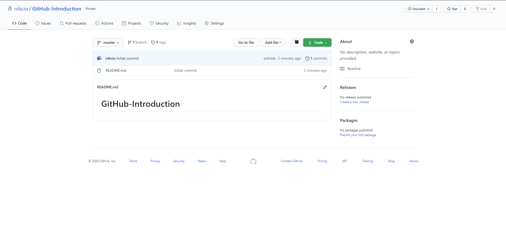
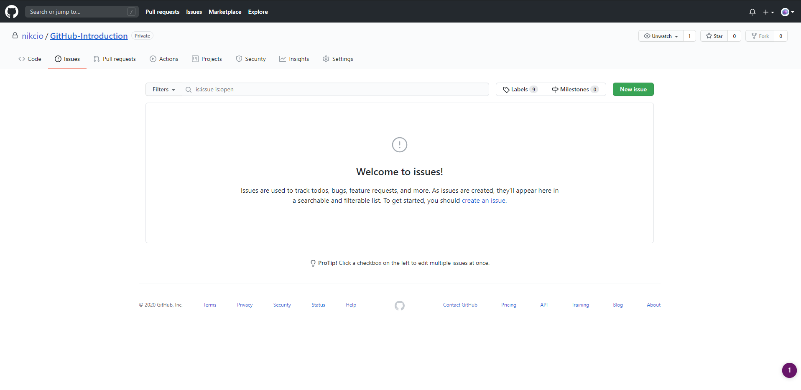
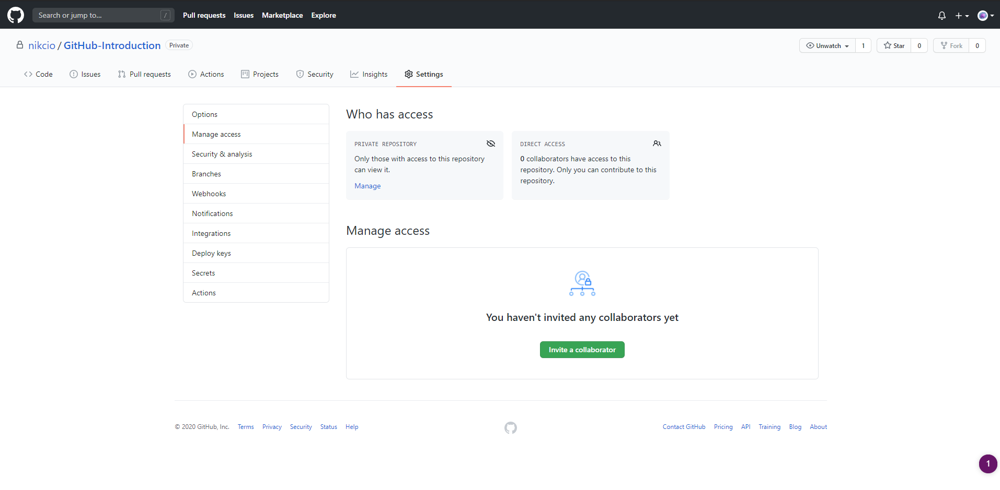

# Step 7 - Navigating the repository

Now that we have some of the fundamentals down we can move on to navigating the GitHub repository.

When opening the repository we're presented with the homepage.

Here we're shown the files of our project along with the README file of the repository.

On the homepage, we can select several windows by navigating the buttons at the top.

One of these buttons takes us to the issues page.

On the issues page, it's possible to create our issues. These issues can be used to plan new features or highlight existing bugs in the repository which have to be fixed.

Next, we have the pull requests page.

On the pull request page, we can see all the active pull requests which are being worked on.

Lastly, we have the most useful tab when working in teams. This tab can be found by going to the settings tab and pressing the Manage access button on the left. Here it's possible to invite your team via the Invite collaborator button.

(The repository has a bunch of other tabs which lay outside the scope of this introduction.)

Now that we can find our way around the GitHub repository we can move on to [Step 8 - gitignore and README](../Step%208%20-%20gitignore%20and%20README/README.md)