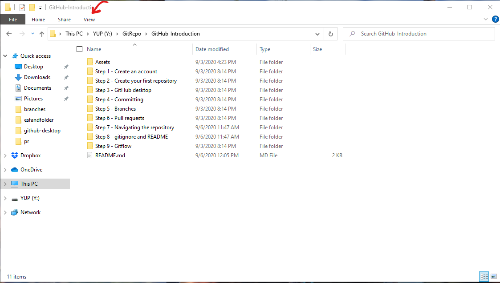
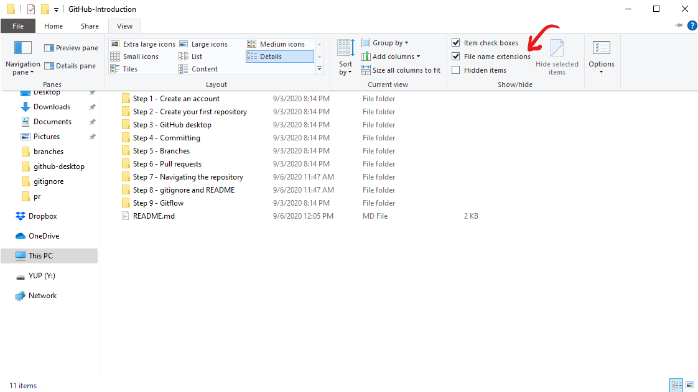

# Step 8 - gitignore and README

When working with Git we have some special filetypes which can be useful to work with two of these are the gitignore filetype and the README.md file.

### What is a gitignore file?
When working with projects and IDEs (Integrated Development Environments) often a bunch of temporary and computer-specific files is created. These files are not something you'd like to commit to your GitHub repository. Therefore we have the gitignore file which makes it possible to ignore specific files and exclude them from the GitHub repository.

### How to see files extensions on files
If you haven't already it's possible to make file extensions visible by marking the option in the files explorer.



First, open the View menu at the top. Then select the option on the right.



You are now able to see the extensions and edit them by renaming the file.


### How to make a gitignore file
To make a gitignore file you have to create a file with no name and the file extension of .gitignore

Then we have to figure out what files we need to ignore. This is something you could do by hand but you could also use existing programs to go generate the content of the gitignore file. One of these tools can be found in [gitignore.io](https://www.gitignore.io/)


This page lets us declare the tools and languages we're working with and creates the contents of the gitignore based on that. One example could be you're working in Visual Studio Code,  Visual Studio, and with the C# language.


Then when you hit create the output will be what should be included in your gitignore file.


We can then just copy and paste this into our gitignore file and be on our way.


### My gitignore isn't working
Sometimes the gitignore file changes can behave like they are not updating. This often happens if you've already committed the files which you wish to ignore. To resolve this problem we can run two commands the command prompt.

```
git rm --cached -r .
git add .
```

This will reset the tracked files and remove any unwanted files from your repository.